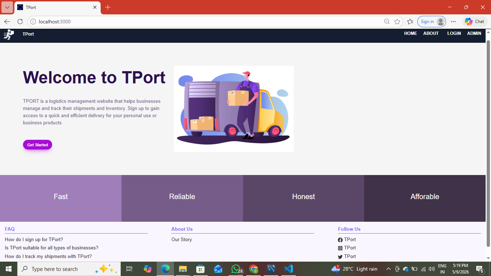
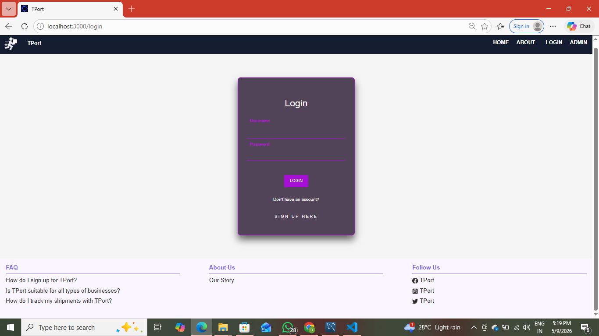
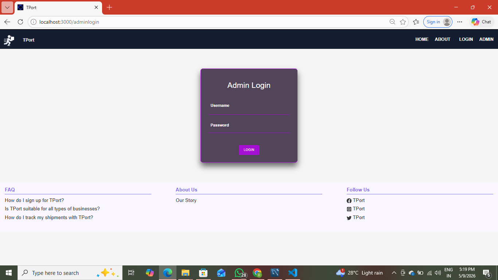
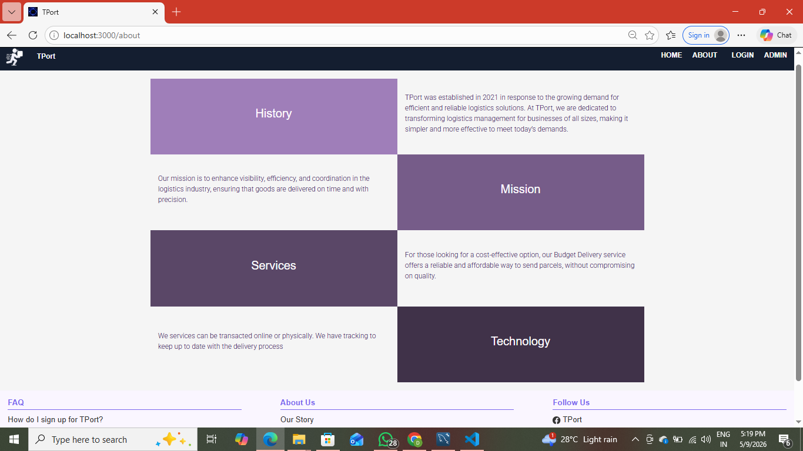

# Logistics Management Website

A modern and responsive **Logistics Management Web Application** built using **React.js**, **Spring Boot**, and **MySQL**.  
This project helps manage logistics operations such as shipment tracking, order management, customer handling, and delivery monitoring through an interactive and user-friendly interface.

---

## Features

- User authentication and login system
- Shipment and order management
- Customer management
- Delivery status tracking
- Responsive dashboard UI
- Fast and dynamic frontend using React.js
- Backend API integration with Spring Boot
- Database connectivity using MySQL

---

## Tech Stack

- **Frontend:** React.js
- **Backend:** Spring Boot
- **Database:** MySQL
- **Styling:** CSS / Bootstrap
- **Language:** JavaScript, Java
- **Tools:** VS Code, npm, Maven, MySQL Workbench

---

## Installation & Setup

### 1. Clone the repository

```bash
git clone https://github.com/your-username/logistics-management-website.git
```

### 2. Navigate to the project folder

```bash
cd LOGISTICS-MANAGEMENT
```

### 3. Install frontend dependencies

```bash
cd frontend
npm install
```

### 4. Run frontend

```bash
npm start
```

### 5. Run backend

```bash
cd backend
mvn spring-boot:run
```

### 6. Open in browser

```bash
http://localhost:3000
```

---

## Screenshots

### Home Page


### Login Page


### Admin


### About

